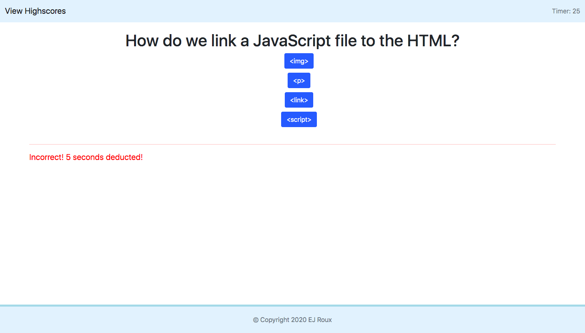

# Code Quiz

## Description

The purpose of this project is to demonstrate my ability to work with the Document Object Model (DOM) and dynamically create elements on the page. This project also shows my ability to use JavaScript event listeners and storing data into local storage to retrieve and display it later on.

Deployed Project: https://eroux13.github.io/code_quiz

## Start Page

This is the home page that gives a brief description of how to play the game. Once the start button is pressed, the game will begin.

## Question (Correct/Incorrect)

Once the start button is pressed, the game will begin. The user is then prompted with a question and once an answer is selected, it will prompt the user with a message either telling them that their selection is correct or incorrect and the will display the next question.

## Submit Highscore

Once all questions have been answered or the timer runs out, the game will end resulting in the calculation of the user's final score. Here the user can input their initials to save to local storage.

## Highscore Page

Once the user submits their initials, the data is then saved into local storage and the user will be redirected to the Highscore page which the application will then retrieve the data the user has submitted and display it on the page. Also on this page, there is a Clear Highscore button which will clear the local storage and a Go Back button which will redirect the user back to the Start Page.

